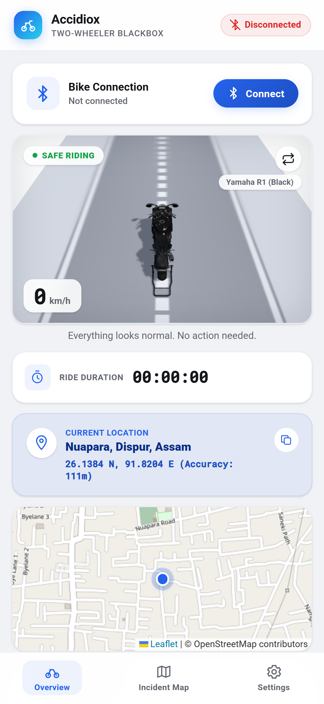
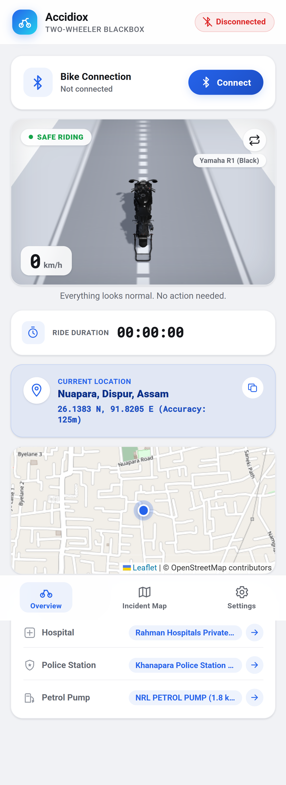
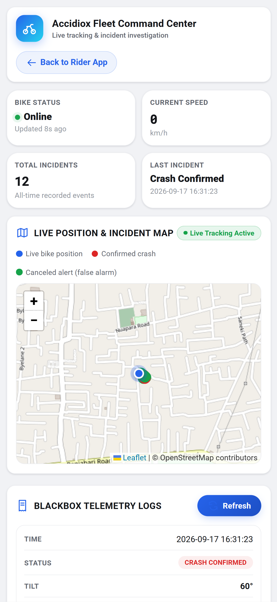

# Accidiox — Autonomous Crash Alert & Ambulance Dispatch for Two-Wheelers

**Live: [accidiox.codingtechnyks.com](https://accidiox.codingtechnyks.com)**
Team Titans · KAYA Buildathon 2026, IIT (BHU) Varanasi · Problem Statement 01, Open Innovation

A rider crashes. Nobody calls anyone. Within a minute, the nearest hospitals
see the crash on a dispatch console with the rider's blood group and
allergies, one of them assigns an ambulance, the crew accepts on their phone,
and the rider's family gets a WhatsApp message and an automatic phone call
with the live location.

That whole chain runs today, on a **₹515** sensor box and four apps.

| Rider app | Live telemetry | Hospital console |
| :---: | :---: | :---: |
|  |  |  |

## Try it

| App | Link | Who it's for |
| :--- | :--- | :--- |
| Rider app | [accidiox.codingtechnyks.com](https://accidiox.codingtechnyks.com) | The rider. Pairs with the box, detects the crash, runs the cancel window. |
| Hospital console | [/hospital_dashboard.html](https://accidiox.codingtechnyks.com/hospital_dashboard.html) | Emergency desk: accept a crash, assign an ambulance, track it in. |
| Ambulance crew app | [/ambulance.html](https://accidiox.codingtechnyks.com/ambulance.html) | The crew: accept within 60 s, navigate, move the case forward. |
| Owner console | [/admin.html](https://accidiox.codingtechnyks.com/admin.html) | Accidiox support: approve hospitals and crews, close false alarms. |

### Install the Android apps

- Rider app: [accidiox-rider.apk](https://accidiox.codingtechnyks.com/downloads/accidiox-rider.apk)
- Ambulance crew app: [accidiox-crew-v1.0.1.apk](https://accidiox.codingtechnyks.com/downloads/accidiox-crew-v1.0.1.apk)

Open the link in Chrome on an Android phone → **Download anyway** (Chrome
warns about every APK outside the Play Store) → open the file → allow installs
from this source → **Install**.

**Tested on Android only.** Both apps are built and signed for Android and
have not been tested on iOS. On an iPhone, use the website links above: the
hospital console and crew app work fully in Safari; the rider app works
except for Bluetooth pairing with the sensor, which iOS browsers don't
support.

## How it works

```
 ESP32 + MPU-6050  ──BLE──►  Rider app (PWA)  ──HTTPS──►  PHP / MySQL backend
   on the bike                 crash + cancel                    │
                                                                 ├─► 3 nearest VERIFIED hospitals  ─► hospital console
                                                                 ├─► WhatsApp to family (Meta API)
                                                                 ├─► automatic voice call (Twilio)
                                                                 └─► email to the alerted hospitals
                                                                        │
                                             ambulance crew app  ◄──────┘  assign → accept (60 s) → en route → admitted
```

**The crash rules.** The bike has to be rolled past 85° and stay there for
**10 continuous seconds**; then the rider gets **20 seconds** to cancel with
one tap. Only after that does anything leave the phone.

**The dispatch rules.** The first hospital to claim a crash owns it, and the
rest are locked out. A crew that doesn't accept within 60 seconds loses the
dispatch. A claim with no accepting crew for 5 minutes goes back to the other
nearby hospitals. A rider who is hurt and untreated cannot cancel the
ambulance. A case nobody answers can be closed by the Accidiox support team
from the owner console, which clears it from every app at once.

**Privacy.** Medical details reach a hospital only after a confirmed crash,
and only a hospital that Accidiox has verified. API keys and credentials live
on the server only, never in this repository.

## What it costs

| | |
| :--- | ---: |
| Hardware, four components | **₹515** |
| Cloud cost per crash (call + WhatsApp + email + maps) | **~₹1.45** |

Full parts list, pinout and schematic: [`docs/hardware/BOM.md`](docs/hardware/BOM.md).

## Repository layout

| Path | What's in it |
| :--- | :--- |
| [`firmware`](firmware) | All ESP32 Arduino code, with a [guide to flashing it](firmware/README.md). |
| [`firmware/esp32_blackbox_industrial`](firmware/esp32_blackbox_industrial) | **The production firmware — the file to flash.** |
| [`firmware/blackbox_gsm_standalone`](firmware/blackbox_gsm_standalone) | Next version with onboard 4G + GPS, for a box that works without the rider's phone. |
| [`firmware/legacy_prototypes`](firmware/legacy_prototypes) | Earlier OLED prototypes, kept to show how the design evolved. |
| [`web_app`](web_app) | The four apps and the PHP/MySQL backend. See [`web_app/README.md`](web_app/README.md). |
| [`web_app/api`](web_app/api) | REST endpoints; shared core in [`api/lib/bootstrap.php`](web_app/api/lib/bootstrap.php). |
| [`docs/hardware`](docs/hardware) | Bill of materials, pinout, circuit schematic. |
| [`docs/screenshots`](docs/screenshots) | App screenshots. |

Deep-dive on the algorithm, the BLE contract, the database schema and the
pinout: **[PROJECT_MASTER_DOCUMENTATION.md](PROJECT_MASTER_DOCUMENTATION.md)**.

## Run it yourself

**Firmware.** See [`firmware/README.md`](firmware/README.md) — open the `.ino`
in the Arduino IDE, select ESP32 Dev Module, upload.

**Backend.** Copy `web_app` into a PHP 8 + MySQL server root (XAMPP works),
then create the config files from their examples:

```
cd web_app/api
cp db_config.example.php        db_config.php        # database credentials
cp email_config.example.php     email_config.php     # SMTP, for hospital mail
cp twilio_voice_config.example.php twilio_voice_config.php   # voice calls
cp meta_whatsapp_config.example.php meta_whatsapp_config.php # WhatsApp
cp geoapify_config.example.php  geoapify_config.php  # maps and geocoding
```

The tables build themselves on the first request. Open `index.html` to create
a rider account, `hospital_dashboard.html` for a hospital account. A new
hospital waits for approval — approve it from the owner console at
`admin.html`, whose first run asks for the database password as a one-time
setup key.

Without the Twilio, Meta and Geoapify keys everything still runs; those
channels just report that they're not configured.

## Honest status

Working end-to-end prototype, deployed and in use for demos.

- Crash detection is tested on controlled drops of a real two-wheeler, not on
  a large crash dataset.
- The current box needs the rider's phone for GPS and internet; the
  phone-free 4G variant is firmware-complete but not field-tested.
- Voice calls run on a trial telephony account, so they reach verified
  numbers only until the account is upgraded.
- The hospital network is the hard part, not the code. Next step is a signed
  pilot with one hospital in Guwahati.

## Team

Built by **Team Titans** for KAYA 2026. Ask before reusing the hospital
dispatch protocol commercially.
