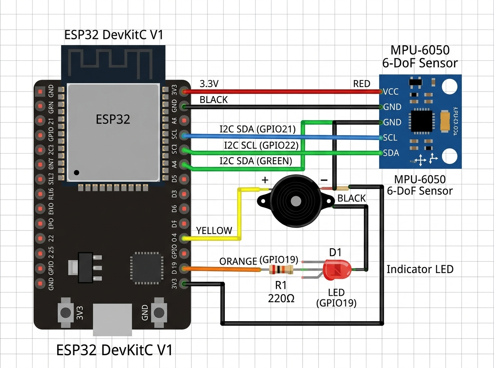

# Bill of materials and circuit

The working Accidiox prototype runs on four components. Everything else —
GPS, internet, the map — comes from the rider's phone, which is why the box
stays this cheap.

## Components

| # | Component | What it does | Qty | Unit cost | Total |
| :--- | :--- | :--- | :--- | ---: | ---: |
| 1 | ESP32 DevKitC V1 | Dual-core 240 MHz, 4 MB flash, BLE 5.0 GATT server | 1 | ₹350 | ₹350 |
| 2 | MPU-6050 6-DoF sensor | 3-axis gyroscope + 3-axis accelerometer, I²C | 1 | ₹120 | ₹120 |
| 3 | Active piezo buzzer (5 V) | Siren during the 20-second crash countdown | 1 | ₹35 | ₹35 |
| 4 | Hazard status LED | Shows Bluetooth and crash state | 1 | ₹10 | ₹10 |
| | | | | **Total** | **₹515** |

About $6.15. Add an enclosure, a regulator and wiring for a road-ready unit.

## Pinout

| Signal | ESP32 pin |
| :--- | :--- |
| MPU-6050 VCC | 3V3 |
| MPU-6050 GND | GND |
| MPU-6050 SDA | GPIO 21 (I²C data) |
| MPU-6050 SCL | GPIO 22 (I²C clock) |
| Buzzer + | GPIO 4 |
| Buzzer − | GND |
| Hazard LED + | GPIO 19, through a 220 Ω resistor |
| Hazard LED − | GND |

## What one emergency costs to run

| Service | What it does | Cost per incident |
| :--- | :--- | ---: |
| Twilio Voice | Automatic voice call to the family | ~₹1.10 |
| Meta WhatsApp Cloud API | Distress message with the live location pin | ~₹0.35 |
| Hospital email | Full medical details to the alerted hospitals | ₹0 (own SMTP) |
| Geoapify | Finds the nearest trauma centres | ₹0 (free tier) |
| | **Total per crash** | **~₹1.45** |

Rates are the published list prices at the time of the build; confirm with
each provider before quoting them.
